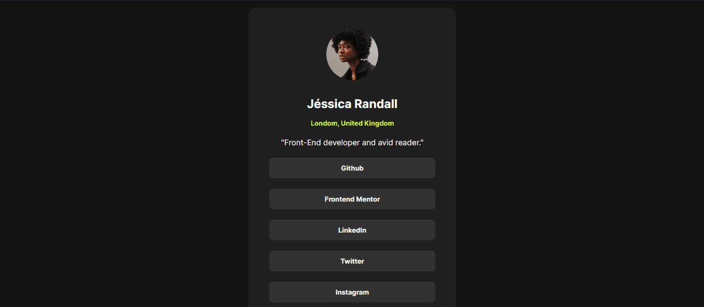

<h1 align="center">Social Profile</h1>

  Projeto da front-end mentor para praticar HTML e CSS do básico até o avançado.
  Mais uma vez utilizando flex, salvando nossas vidas de programador.

 

  

## 🚀 Tecnologias

Esse projeto foi desenvolvido com as seguintes tecnologias:

- HTML e CSS(flex)
- Git e Github

## 💻 Projeto

Projeto do front-end mentor. <a href="https://www.frontendmentor.io/challenges/social-links-profile-UG32l9m6dQ">Clique aqui</a> para saber o projeto.

## Como ficou o projeto online

  

  
<a href="https://frontendmentorsocialprofile.vercel.app/" target="_blank">Clique para acessar o link</a>

## Conclusão

Esse projeto foi fácil de fazer. Apenas tive que colocar display: flex na tag main para deixar tudo centralizado.

Esse projeto serve para testar os conhecimentos básicos.